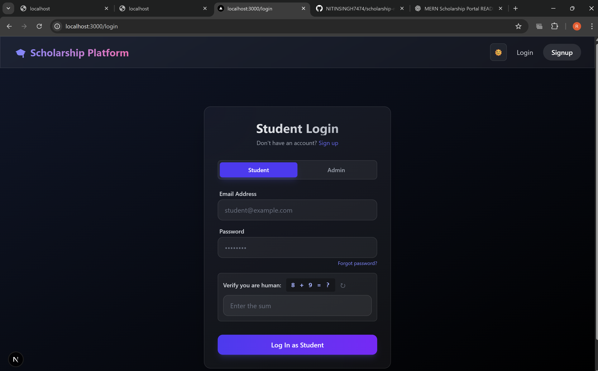
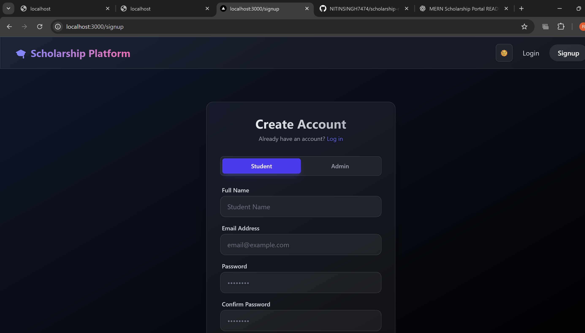
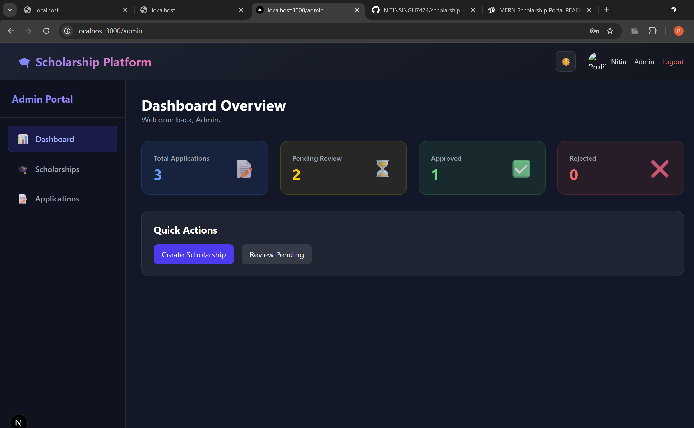
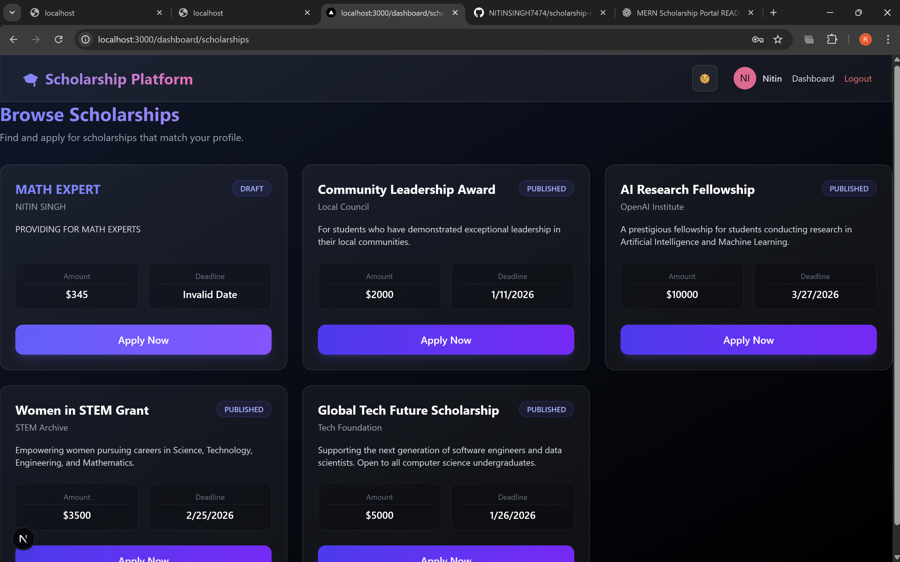
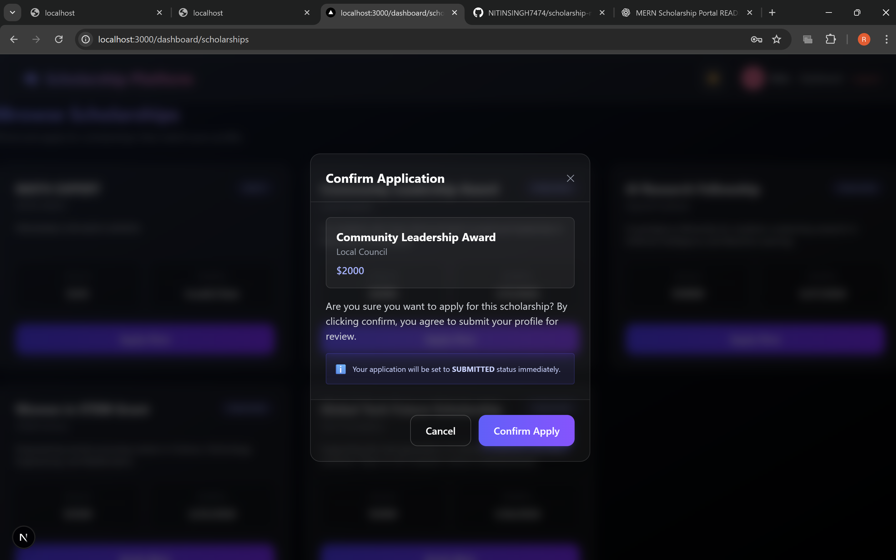
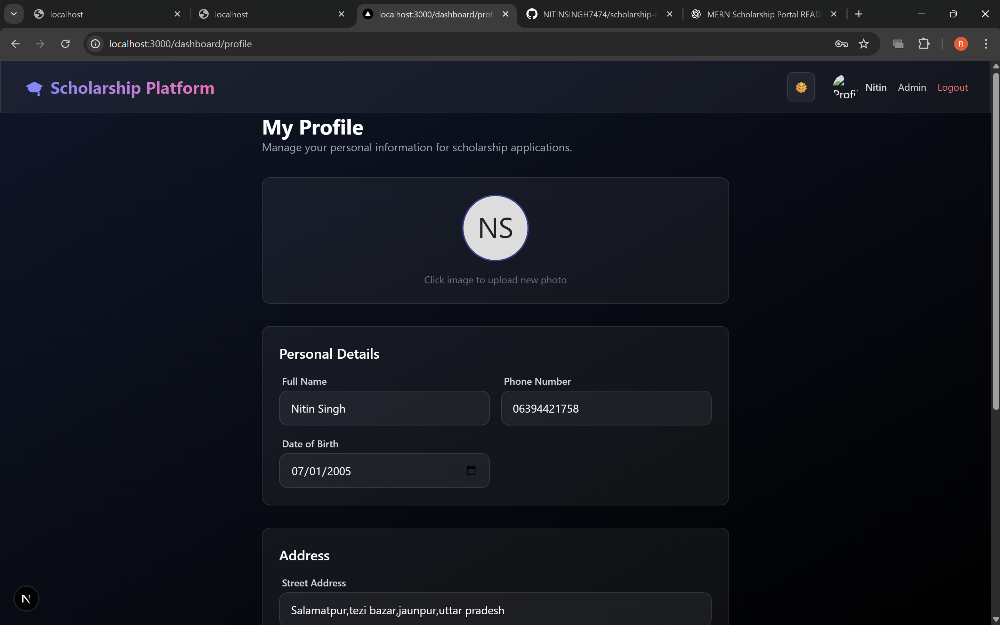
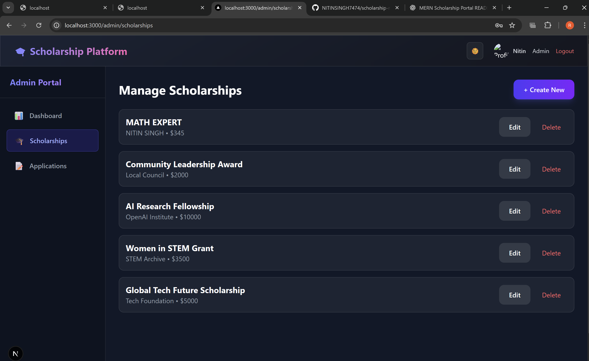
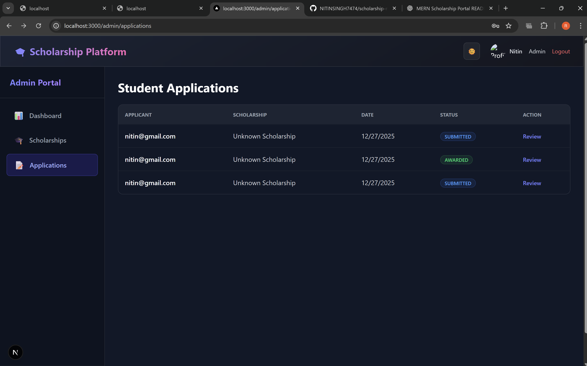
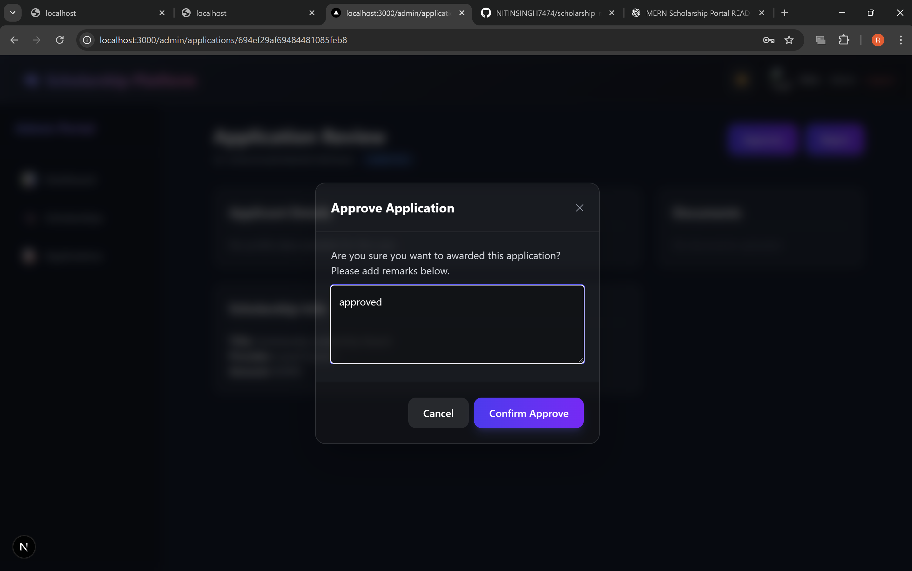

# 🎓 Scholarship Application and Management Portal

A comprehensive full-stack web application designed to streamline and digitize the scholarship application process. This portal provides a centralized, role-based system where students can easily apply for scholarships and administrators can efficiently manage applications.

---

## 📋 Table of Contents

- [Overview](#overview)
- [Problem Statement](#problem-statement)
- [Key Features](#key-features)
- [Technology Stack](#technology-stack)
- [Project Structure](#project-structure)
- [Installation & Setup](#installation--setup)
- [Usage](#usage)
- [Screenshots](#screenshots)
- [API Endpoints](#api-endpoints)
- [Testing](#testing)
- [Docker Support](#docker-support)
- [Challenges Faced](#challenges-faced)
- [Future Enhancements](#future-enhancements)
- [Contributing](#contributing)
- [License](#license)
- [Contact](#contact)

---

## 🌟 Overview

The **Scholarship Application and Management Portal** is a MERN-based web application that solves the complexities of traditional scholarship application processes. It ensures transparency, reduces paperwork, and provides real-time status updates for both students and administrators.

### Why This Project?

Scholarship applications often involve:
- Complex procedures with multiple forms and documents
- Lack of transparency in application status
- Delayed communication between students and administrators
- Manual processing leading to errors and inefficiencies

This portal addresses these challenges by providing a **centralized, digital platform** with separate portals for Students and Admins, ensuring secure access and structured workflows.

---

## 🎯 Problem Statement

Traditional scholarship applications lack transparency and involve complex processes. This portal is designed to:
- **Simplify** the application process for students
- **Streamline** application review for administrators
- **Track** eligibility and application status in real-time
- **Ensure** timely communication with applicants

---

## ✨ Key Features

### 🎓 Student Portal

- ✅ **Secure Authentication** - User registration and login with JWT-based sessions
- ✅ **Profile Management** - Complete profile setup with personal, educational, and family details
- ✅ **Avatar Upload** - Profile photo upload with real-time updates
- ✅ **Scholarship Browsing** - View available scholarships with detailed eligibility criteria
- ✅ **Application System** - Step-by-step application form with document upload support
- ✅ **Status Tracking** - Real-time updates on application status (Submitted, Under Review, Approved, Rejected)
- ✅ **Application History** - View all previously submitted applications
- ✅ **Dark/Light Mode** - Modern UI with theme toggle support
- ✅ **Responsive Design** - Mobile-friendly interface
- ✅ **Notifications** - Email and SMS alerts for important updates
- ✅ **Password Recovery** - Forgot password and reset password functionality
- ✅ **Captcha Verification** - Enhanced security for authentication

### 🛡️ Admin Portal

- ✅ **Dashboard** - Overview of total applications, pending reviews, and approval statistics
- ✅ **Scheme Management** - Create, update, and remove scholarship schemes
- ✅ **Application Review** - Detailed view of student applications and uploaded documents
- ✅ **Workflow Management** - Approve or reject applications with mandatory remarks
- ✅ **User Management** - Oversee student and admin accounts
- ✅ **Role-based Authorization** - Secure access control

---

## 💻 Technology Stack

### Backend (API)

| Technology | Purpose |
|------------|---------|
| **Node.js** | Runtime environment |
| **Express.js (v5)** | Web framework |
| **MongoDB** | NoSQL database |
| **Mongoose** | MongoDB ODM |
| **Redis** | Caching and session management |
| **JWT & Bcrypt** | Authentication and password hashing |
| **Joi** | Request validation |
| **Multer** | File upload handling |
| **Nodemailer** | Email notifications |
| **Twilio** | SMS notifications |
| **Helmet** | Security headers |
| **CORS** | Cross-origin resource sharing |
| **Express Rate Limit** | API rate limiting |
| **Jest & Supertest** | Testing framework |

### Frontend (User Interface)

| Technology | Purpose |
|------------|---------|
| **Next.js 16** | React framework with App Router |
| **React 19** | UI library |
| **TypeScript** | Type-safe JavaScript |
| **TailwindCSS v4** | Utility-first CSS framework |
| **Redux Toolkit** | State management |
| **React Hook Form** | Form handling |
| **Zod** | Schema validation |
| **Axios** | HTTP client |

### DevOps & Tools

- **Docker & Docker Compose** - Containerization
- **ESLint** - Code linting
- **Prettier** - Code formatting
- **Git & GitHub** - Version control
- **MongoDB Memory Server** - In-memory testing database

---

## 📂 Project Structure

```
scholarship-management/
│
├── scholarship-backend/              # Backend API
│   ├── src/
│   │   ├── config/                  # Configuration files (database, redis, etc.)
│   │   ├── controllers/             # Request handlers
│   │   ├── emails/                  # Email templates
│   │   ├── middlewares/             # Custom middleware (auth, error handling)
│   │   ├── models/                  # Mongoose schemas
│   │   ├── routes/                  # API route definitions
│   │   ├── services/                # Business logic (email, SMS, file upload)
│   │   ├── tests/                   # Unit and integration tests
│   │   ├── utils/                   # Helper functions
│   │   ├── validators/              # Request validation schemas
│   │   ├── app.js                   # Express app setup
│   │   └── server.js                # Server entry point
│   ├── uploads/                     # File upload directory
│   ├── .env                         # Environment variables
│   ├── .env.example                 # Environment variables template
│   ├── package.json                 # Dependencies and scripts
│   └── jest.config.js               # Jest configuration
│
├── scholarship-frontend/            # Frontend Application
│   ├── app/                        # Next.js App Router pages
│   │   ├── dashboard/              # Student dashboard pages
│   │   ├── login/                  # Authentication pages
│   │   └── layout.tsx              # Root layout
│   ├── src/
│   │   ├── components/             # React components
│   │   │   └── ui/                 # Reusable UI components
│   │   ├── lib/                    # Utilities and helpers
│   │   └── store/                  # Redux store and slices
│   ├── public/                     # Static assets
│   ├── .env.local                  # Environment variables
│   ├── package.json                # Dependencies and scripts
│   ├── next.config.ts              # Next.js configuration
│   └── tailwind.config.ts          # TailwindCSS configuration
│
├── screenshotss/                   # Application screenshots
├── docker-compose.yml              # Docker services configuration
├── README.md                       # Project documentation
└── .git/                          # Git repository
```

---

## 🚀 Installation & Setup

### Prerequisites

Before you begin, ensure you have the following installed:
- **Node.js** (v18 or higher) - [Download](https://nodejs.org/)
- **MongoDB** (Local or Atlas) - [Download](https://www.mongodb.com/try/download/community)
- **Redis** (Optional, for caching) - [Download](https://redis.io/download)
- **Git** - [Download](https://git-scm.com/)

### 1️⃣ Clone the Repository

```bash
git clone https://github.com/NITINSINGH7474/scholarship-management.git
cd scholarship-management
```

### 2️⃣ Backend Setup

Navigate to the backend directory:

```bash
cd scholarship-backend
```

Install dependencies:

```bash
npm install
```

Create a `.env` file in the `scholarship-backend/` directory:

```env
# Server Configuration
PORT=5000
NODE_ENV=development

# Database
MONGO_URI=mongodb://localhost:27017/scholarship_db
# or use MongoDB Atlas:
# MONGO_URI=mongodb+srv://<username>:<password>@cluster.mongodb.net/scholarship_db

# JWT Secrets
JWT_ACCESS_SECRET=your_super_secret_access_key_change_this
JWT_REFRESH_SECRET=your_super_secret_refresh_key_change_this
JWT_ACCESS_EXPIRES_IN=15m
JWT_REFRESH_EXPIRES_IN=7d

# Redis (Optional)
REDIS_HOST=localhost
REDIS_PORT=6379

# Feature Flags
EMAIL_DISABLED=false
SMS_DISABLED=true

# Email Configuration (if EMAIL_DISABLED=false)
EMAIL_HOST=smtp.gmail.com
EMAIL_PORT=587
EMAIL_USER=your-email@gmail.com
EMAIL_PASSWORD=your-app-password

# Twilio SMS (if SMS_DISABLED=false)
TWILIO_ACCOUNT_SID=your_twilio_account_sid
TWILIO_AUTH_TOKEN=your_twilio_auth_token
TWILIO_PHONE_NUMBER=your_twilio_phone_number

# File Uploads
UPLOAD_DIR=uploads
MAX_FILE_SIZE=5242880
```

Start the backend server:

```bash
# Development mode with auto-reload
npm run dev

# Production mode
npm start
```

The backend API will be available at `http://localhost:5000`

### 3️⃣ Frontend Setup

Open a new terminal and navigate to the frontend directory:

```bash
cd scholarship-frontend
```

Install dependencies:

```bash
npm install
```

Create a `.env.local` file in the `scholarship-frontend/` directory:

```env
NEXT_PUBLIC_API_URL=http://localhost:5000
```

Start the development server:

```bash
npm run dev
```

The frontend will be available at `http://localhost:3000`

### 4️⃣ Database Setup

If using MongoDB locally, ensure MongoDB is running:

```bash
# Linux/macOS
mongod

# Windows
net start MongoDB
```

The application will automatically create the database and collections on first run.

---

## 🐳 Docker Support

For easier setup, you can use Docker Compose to run MongoDB and Redis:

```bash
# Start MongoDB and Redis containers
docker-compose up -d

# Stop containers
docker-compose down

# View logs
docker-compose logs -f
```

The `docker-compose.yml` includes:
- **MongoDB**: Available on port 27017
- **Redis**: Available on port 6379

---

## 📖 Usage

### For Students

1. **Sign Up**: Create an account with your email and password
2. **Complete Profile**: Fill in personal, educational, and family details
3. **Browse Scholarships**: View available scholarships with eligibility criteria
4. **Apply**: Submit applications with required documents
5. **Track Status**: Monitor your application status in real-time
6. **Manage Profile**: Update profile information and upload avatar

### For Administrators

1. **Login**: Access the admin portal with admin credentials
2. **Dashboard**: View application statistics and pending reviews
3. **Manage Schemes**: Create, update, or delete scholarship schemes
4. **Review Applications**: View and evaluate student applications
5. **Make Decisions**: Approve or reject applications with remarks

---

## 📸 Screenshots

### Student Portal

#### Student Login


#### Student Signup


#### Dashboard Overview


#### Student Dashboard


#### Scholarship List


#### Apply for Scholarship


#### Application Status


#### Profile Page


### Admin Portal

#### Manage Scholarships


#### Accept/Reject Applications


#### Approve/Decline


---

## 🔌 API Endpoints

### Authentication

| Method | Endpoint | Description | Access |
|--------|----------|-------------|--------|
| POST | `/api/auth/signup` | Register new user | Public |
| POST | `/api/auth/login` | User login | Public |
| POST | `/api/auth/logout` | User logout | Private |
| POST | `/api/auth/refresh` | Refresh access token | Private |
| POST | `/api/auth/forgot-password` | Request password reset | Public |
| POST | `/api/auth/reset-password` | Reset password | Public |

### Students

| Method | Endpoint | Description | Access |
|--------|----------|-------------|--------|
| GET | `/api/students/profile` | Get student profile | Private (Student) |
| PUT | `/api/students/profile` | Update student profile | Private (Student) |
| POST | `/api/students/avatar` | Upload profile avatar | Private (Student) |

### Scholarships

| Method | Endpoint | Description | Access |
|--------|----------|-------------|--------|
| GET | `/api/scholarships` | Get all scholarships | Private |
| GET | `/api/scholarships/:id` | Get scholarship by ID | Private |
| POST | `/api/scholarships` | Create new scholarship | Private (Admin) |
| PUT | `/api/scholarships/:id` | Update scholarship | Private (Admin) |
| DELETE | `/api/scholarships/:id` | Delete scholarship | Private (Admin) |

### Applications

| Method | Endpoint | Description | Access |
|--------|----------|-------------|--------|
| GET | `/api/applications` | Get all applications | Private |
| GET | `/api/applications/:id` | Get application by ID | Private |
| POST | `/api/applications` | Submit new application | Private (Student) |
| PUT | `/api/applications/:id` | Update application status | Private (Admin) |
| GET | `/api/applications/student/history` | Get student's applications | Private (Student) |

---

## 🧪 Testing

The backend includes comprehensive test coverage using Jest and Supertest.

Run tests:

```bash
cd scholarship-backend

# Run all tests
npm test

# Run tests with coverage
npm test -- --coverage

# Run tests in watch mode
npm test -- --watch
```

Test coverage includes:
- Unit tests for controllers
- Integration tests for API endpoints
- Database model validation
- Authentication and authorization
- Error handling

---

## 🚧 Challenges Faced

During the development of this project, several key challenges were encountered and overcome:

1. **Role-based Authentication & Authorization**
   - Implementing secure JWT-based authentication for multiple user roles
   - Ensuring proper access control for student and admin portals
   - Managing token refresh and session persistence

2. **State Management**
   - Managing complex application state across multiple components using Redux Toolkit
   - Synchronizing authentication state between frontend and backend
   - Handling optimistic updates for better UX

3. **File Upload & Storage**
   - Implementing secure file upload with validation
   - Managing multiple document types (images, PDFs, etc.)
   - Handling file size limits and error cases

4. **Responsive Design**
   - Creating a mobile-first, responsive interface
   - Implementing dark/light theme support
   - Ensuring consistent UI across different screen sizes

5. **Real-time Status Updates**
   - Synchronizing application status between database and UI
   - Implementing efficient data fetching strategies
   - Managing loading states and error handling

6. **API Integration**
   - Setting up proper error handling and validation
   - Implementing rate limiting to prevent abuse
   - Ensuring API security with CORS and Helmet

---

## 🔮 Future Enhancements

Potential improvements for future versions:

- [ ] **Payment Integration** - Add scholarship payment processing
- [ ] **Document Verification** - Automated document authenticity checks
- [ ] **Advanced Search** - Elasticsearch integration for better scholarship discovery
- [ ] **Recommendation System** - AI-powered scholarship recommendations
- [ ] **Multi-language Support** - Internationalization (i18n)
- [ ] **Analytics Dashboard** - Advanced reporting and analytics for admins
- [ ] **Mobile App** - React Native mobile application
- [ ] **Real-time Notifications** - WebSocket-based live updates
- [ ] **Export Features** - PDF/Excel export of applications
- [ ] **Audit Trail** - Comprehensive logging of all actions

---

## 🤝 Contributing

Contributions are welcome! Please follow these steps:

1. **Fork the repository**
2. **Create a new branch**
   ```bash
   git checkout -b feature/AmazingFeature
   ```
3. **Make your changes**
4. **Commit your changes**
   ```bash
   git commit -m 'Add some AmazingFeature'
   ```
5. **Push to the branch**
   ```bash
   git push origin feature/AmazingFeature
   ```
6. **Open a Pull Request**

### Code Style

- Follow the existing code style
- Use ESLint and Prettier for formatting
- Write meaningful commit messages
- Add tests for new features
- Update documentation as needed

---

## 📝 License

Distributed under the MIT License. See `LICENSE` file for more information.

---

## 📞 Contact

**Nitin Singh**

- Email: [nitinsingh14210@gmail.com](mailto:nitinsingh14210@gmail.com)
- GitHub: [@NITINSINGH7474](https://github.com/NITINSINGH7474)
- Project Repository: [scholarship-management](https://github.com/NITINSINGH7474/CSE326-website-ca3)

---

## 🙏 Acknowledgments

- Next.js team for the amazing framework
- MongoDB and Mongoose for the robust database solution
- TailwindCSS for the utility-first CSS framework
- All open-source contributors whose libraries made this project possible

---

## 🏁 Conclusion

The **Scholarship Application and Management Portal** provides a transparent, efficient, and user-friendly solution for managing scholarship applications. It simplifies the process for students while giving administrators complete control over application review and decision-making.

This project demonstrates practical knowledge of:
- Full-stack MERN development
- Authentication and authorization
- State management with Redux
- Modern UI/UX design
- API development and integration
- Database design and optimization
- Testing and deployment

---

<div align="center">
  <p>Made with ❤️ by Nitin Singh</p>
  <p>⭐ Star this repository if you find it helpful!</p>
</div>
